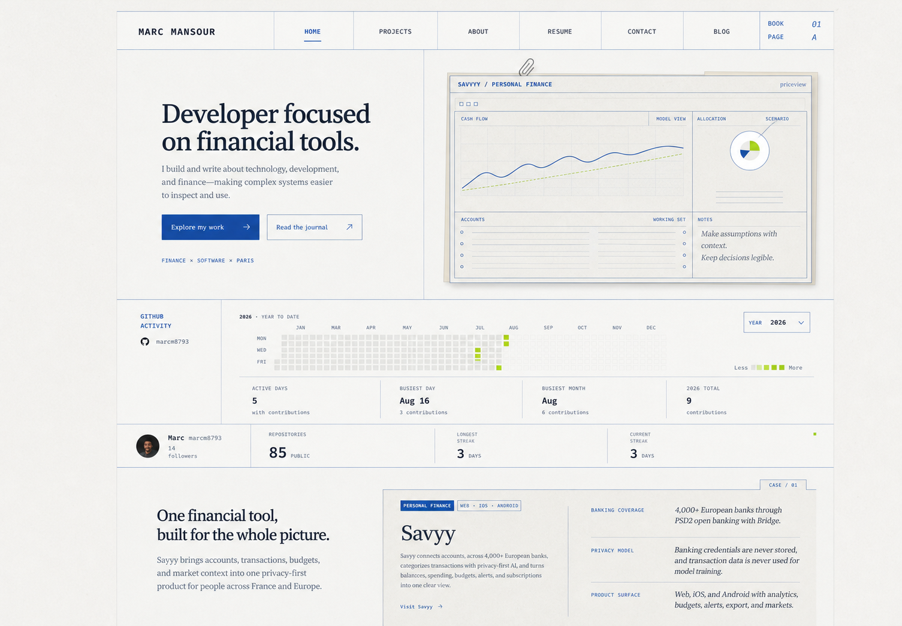
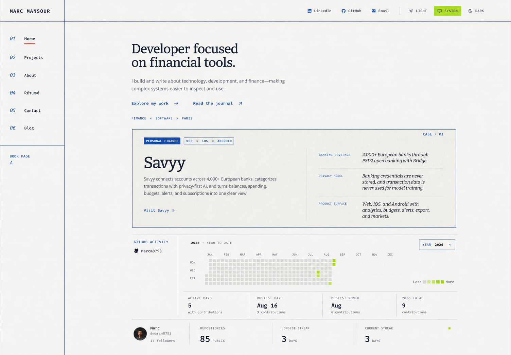
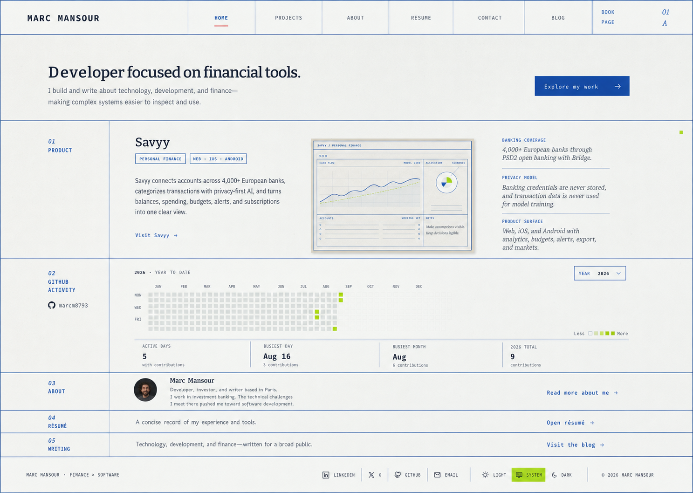

# Sober portfolio style review

These studies preserve the existing **Activity Ledger** identity while reducing its visual volume. They are direction comps, not screenshots to trace literally, and they do not change the production pages.

## What currently feels too large

- The global shell is `96rem` wide, so the page behaves like a presentation board on large displays.
- Major headings frequently resolve between `4.5rem` and `6rem`; on mobile, several headings begin around `3.4rem` and break into four to seven short lines.
- Long proposition-style sentences are repeatedly used as display headings, making every section compete with the hero.
- Section min-heights of roughly `25rem` to `54rem` amplify the type scale and create long stretches with one dominant sentence.
- The ledger rules, texture, annotations, tabs, and large type all carry emphasis at once. The identity is strong, but too many elements speak at full volume.

## Shared recommendation

- Keep Bitter, Open Sans, Source Code Pro, paper stock, cobalt rules, and sparse lime data.
- Reduce the main shell to `68rem`–`72rem`.
- Cap the homepage hero near `3.25rem` desktop and `2.75rem` mobile.
- Cap ordinary section headings near `2.25rem`–`2.5rem`; reserve roughly `3rem` for the project name only.
- Keep body copy at `1rem` with a `65ch`–`72ch` measure.
- Replace long display sentences with compact titles plus one short supporting paragraph.
- Reduce decorative annotations and soften secondary rules before removing the ledger character itself.

## Proposal A — Quiet Ledger

The closest evolution of the current site. It keeps the asymmetric hero and case-file proof, but makes the shell narrower, headings smaller, rules lighter, and activity evidence more compact.

Suggested system values:

- Shell: `72rem`
- Hero: `clamp(2.75rem, 4vw, 3.25rem)`
- Section heading: `clamp(2rem, 3vw, 2.5rem)`
- Project name: `clamp(2.75rem, 4vw, 3.5rem)`
- Section spacing: `clamp(4rem, 6vw, 6rem)`

Best when the goal is to preserve the present composition with the least disruption.

## Proposal B — Editorial Column

A more editorial reading experience. A slim index rail carries navigation while the main content becomes a calm publication column. Savyy and GitHub remain evidence, but neither competes with the introduction.

Suggested system values:

- Shell: `70rem` plus a `9rem` index rail at large breakpoints
- Hero: `clamp(2.5rem, 3.6vw, 3rem)`
- Section heading: `clamp(1.875rem, 2.8vw, 2.25rem)`
- Body measure: `68ch`
- Section spacing: `clamp(3.5rem, 5vw, 5rem)`

Best when the portfolio should feel more like an enduring publication than a landing page.

## Proposal C — Compact Index

The most discreet option. The homepage becomes an efficient project index made of restrained ruled rows. Visitors see Savyy, public activity, About, résumé, and writing in one viewport without giant text.

Suggested system values:

- Shell: `66rem`–`68rem`
- Hero: `clamp(2.25rem, 3.2vw, 2.75rem)`
- Section titles: `clamp(1.5rem, 2.4vw, 2rem)`
- Body: `0.9375rem`–`1rem`
- Row spacing: `1.5rem`–`2.25rem`

Best when discretion, speed, and scanability matter most.

## Recommended direction

Use **Proposal A** as the base, then borrow Proposal C's compact lower-page index. This retains the memorable case-file object and live GitHub proof while solving the oversized type and over-wide shell across the system.

## Image-generation prompt set

All three comps were generated with the built-in image-generation tool using the real desktop and mobile homepage screenshots as identity and content references.

### A

> Create a high-fidelity 1440×1000 desktop homepage study called “Quiet Ledger.” Preserve the Activity Ledger identity, existing font trio, recycled paper, deep navy ink, restrained cobalt rules, sparse lime data, real sections, and factual copy. Reduce the shell to about 72rem, keep the hero at 46–52px and at most three lines, retain a smaller asymmetric Savyy case-file specimen, cap section headings at 30–38px, and keep body copy at 16px. Use fewer annotations and softer rules. Avoid giant words, full-screen sentences, new claims, gradients, rounded cards, bento grids, glossy dashboards, and watermarks.

### B

> Create a high-fidelity 1440×1000 desktop homepage study called “Editorial Column.” Preserve the Activity Ledger palette, fonts, paper texture, rule vocabulary, Savyy truth, and real sections. Use a 68–70rem centered reading sheet with a slim left index rail and a comfortable main column. Keep the hero at 40–46px, at most three lines, with one-sentence support and compact text-link actions. Place Savyy in a medium horizontal dossier and GitHub in a restrained activity strip. Use 28–36px section headings and 16px body copy at 68ch. Avoid oversized typography, long line-filling slogans, fake facts, centered ceremony, pills, floating cards, gradients, and watermarks.

### C

> Create a high-fidelity 1440×1000 desktop homepage study called “Compact Index.” Preserve the existing fonts, recycled paper, navy/cobalt ledger accents, sparse lime, and factual content. Constrain the shell to 64–68rem and make the homepage a refined project index: a 36–42px introduction, one short support line, one small primary action, then ruled rows for Savyy, GitHub activity, About, résumé, and writing. Use 24–32px section titles, 15–16px body copy, subtle metadata, and reduced vertical padding. Avoid giant words, long slogans, fake metrics, bento cards, gradients, glossy surfaces, excess ornament, and watermarks.
